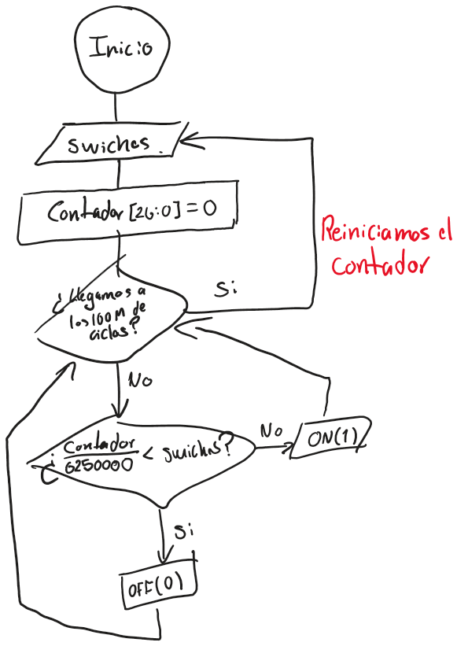

### Ejercicio 4. Modulación de ancho de pulso
1.  Diseñe un módulo que reciba como entrada un código de 4 bits por medio de interruptores.
2. El módulo debe utilizar dicha entrada como código de nivel para una modulación PWM que se enviará como salida a un pin de la FPGA. El ancho del pulso debe ser alrededor de 1ms.
3. Se colocará como carga un LED de la tarjeta.
4. Valide el funcionamiento de su diseño mediante un testbench exhaustivo.
5. Realice una validación de su diseño en la tarjeta con FPGA que se utilizará a lo largo del
 curso.

## Plantamiento del problema
 Para este problema se puede establecer que en el total de un ciclo de 1ms hay que repartir en un cierto porcentaje definido por la entrada (En este caso los swiches), este siendo el tiempo dentro de ese 1ms se encienda y luego se apague el LED del la placa o también visto como 1 o 0 en a salida del sistema. Este número es actualizado en cada periodo.
Para el diseño se propone el siguiente diagrama de flujo: 

 ## Codigo de pruebas en vivado 

 Antes de subir el archivo a la tarjeta Tang Nano 9k, se debe realizar una prueba con el maximo de bits que corresponde a 4, siendo estos capaces de representar de 0 a 16 en binario para poder realizar icha prueba se utilizó simple_pwm.sv, al realizar está prueba se debera ver una entrada de 4 bits que contiene el número binario que se registra en el nterruptor. De está forma uno de los leds de la tarjeta deberan de asosiar la salida dada por la programación. Se debe tener en cuenta que se puede generar ruido por el uso de la protoboard o los jumpers o falsos contactos que pueden probocar fallas en el funcionamiento.
 
Thestbensh 
Para la prueba el código se programo simple_pwm_tb.sv. Se obtuvieron los siguientes resultados:

 
## Videos de preuba del PWM
#Prueba con entrada de 0001
https://github.com/user-attachments/assets/bf8e0ebc-c83b-42b7-a944-b6ca512eaf43

